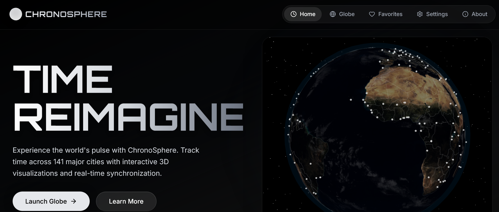
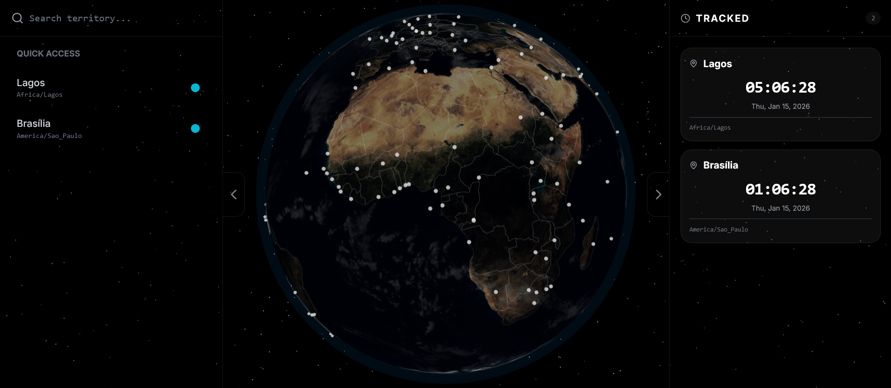

# 🌍 ChronoSphere

ChronoSphere is a premium, immersive 3D world clock application built with React, Three.js, and TypeScript. It offers a futuristic way to track global time through an interactive high-fidelity globe and synchronized temporal nodes.



## ✨ Features

- **Immersive 3D Globe**: Interactive Earth visualization with realistic day/night lighting, atmosphere effects, and country borders.
- **Global Time Tracking**: Monitor time across hundreds of cities and territories worldwide.
- **Smart Search**: Advanced prioritized search engine for cities, countries, and continents.
- **Persistent Favorites**: Tracked cities are saved to local storage and synchronized across all views (Home, Globe, Favorites).
- **Responsive Design**: Fully optimized for desktop and mobile devices with a sleek, adaptive UI.
- **Dark Mode Only**: A dedicated, premium aesthetic designed for high-end digital environments.

## 🚀 Tech Stack

- **Core**: [React](https://reactjs.org/) + [TypeScript](https://www.typescriptlang.org/) + [Vite](https://vitejs.dev/)
- **3D Engine**: [Three.js](https://threejs.org/) via [@react-three/fiber](https://github.com/pmndrs/react-three-fiber) & [@react-three/drei](https://github.com/pmndrs/drei)
- **Styling**: [TailwindCSS](https://tailwindcss.com/)
- **Animations**: [Framer Motion](https://www.framer.com/motion/)
- **Icons**: [Lucide React](https://lucide.dev/)

## 📸 Screenshots

### Globe Interface


### Home page


## 🛠️ Installation

1. **Clone the repository**:
   ```bash
   git clone https://github.com/christian759/chronosphere.git
   cd chronosphere
   ```

2. **Install dependencies**:
   ```bash
   npm install
   ```

3. **Run development server**:
   ```bash
   npm run dev
   ```

4. **Build for production**:
   ```bash
   npm run build
   ```

## 👤 Developer

Built with ❤️ by **c2** (Christian Eighemhenrio)

- **GitHub**: [@christian759](https://github.com/christian759)
- **LinkedIn**: [Christian Eighemhenrio](https://www.linkedin.com/in/christian-eighemhenrio-1b77b63a2/)

---

© 2026 ChronoSphere • Digital Horizon
